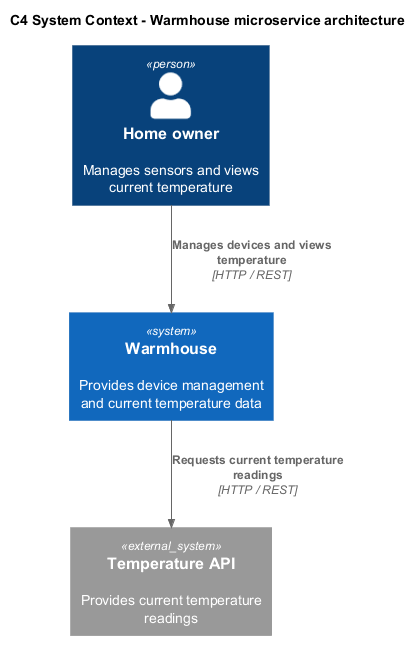
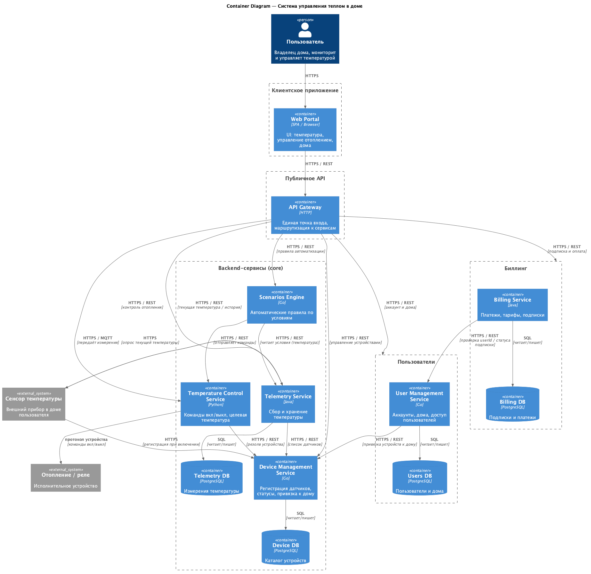
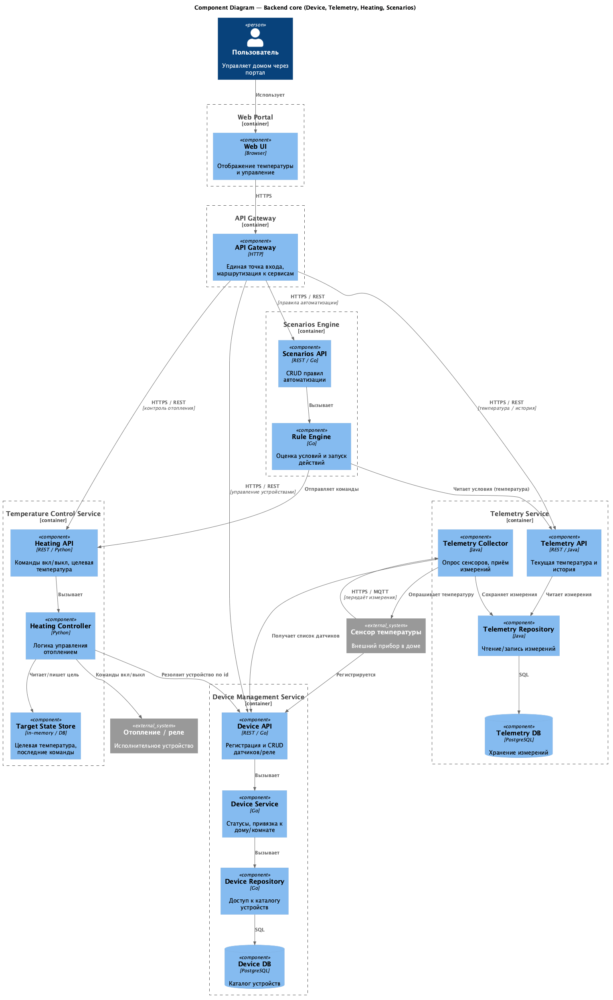
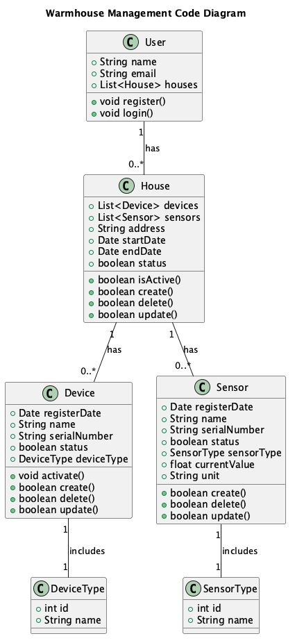

# Задание 1. Анализ и планирование

## 1. Описание функциональности монолитного приложения

**Управление отоплением:**

- Пользователи могут управлять отоплением (включить и выключать отопление) в своих домах
- Система управляет датчиками, установленными в домах

**Мониторинг температуры:**

- Пользователи могут получать информацию о текущей температуре в своих домах через веб-интерфейс
- Cистема получает данные о температуре с тепмературы датчиков в домах.

## 2. Анализ архитектуры монолитного приложения

- Взаимодействие между компонентами синхронное
- Датчик регистрируется в системе при включении
- Сервер напрямую управлеяет датчиками в доме для контроля температуры
- Данные о температуре сервер получает через прямой запрос к датчику
- Текущая система реализована монолитным приложеним на Go
- Базы данных  - PostgreSQL.

## 3. Определение доменов и границы контекстов

**Основные (core)**
- Управление устройствами — регистрация датчиков, статусы, привязка к дому
- Телеметрия — сбор и хранение температуры, текущие значения
- Управление отоплением — команды вкл/выкл, целевая температура

**Вспомогательные (supporting)**
- Web-портал — доступ пользователя, аккаунт и дома
- Сценарии — автоматические правила по условиям

**Общие (generic)**
- Биллинг — платежи, тарифы, статус подписки

## 4. Проблемы монолитного решения

- Масштабируемость — сложно масштабировать отдельные части системы, нужно масштабировать весь монолит
- Развертывание — любое изменение требует пересборки и деплоя всего приложения
- Разделение команд — трудно разделить ответственность и дать командам работать независимо

## 5. Визуализация контекста системы — диаграмма С4



# Задание 2. Проектирование микросервисной архитектуры

В этом задании вам нужно предоставить только диаграммы в модели C4. Мы не просим вас отдельно описывать получившиеся микросервисы и то, как вы определили взаимодействия между компонентами To-Be системы. Если вы правильно подготовите диаграммы C4, они и так это покажут.

**Диаграмма контейнеров (Containers)**



**Диаграмма компонентов (Components)**



**Диаграмма кода (Code)**



# Задание 3. Разработка ER-диаграммы

Добавьте сюда ER-диаграмму. Она должна отражать ключевые сущности системы, их атрибуты и тип связей между ними.

# Задание 4. Создание и документирование API

### 1. Тип API

Укажите, какой тип API вы будете использовать для взаимодействия микросервисов. Объясните своё решение.

### 2. Документация API

Здесь приложите ссылки на документацию API для микросервисов, которые вы спроектировали в первой части проектной работы. Для документирования используйте Swagger/OpenAPI или AsyncAPI.

# Задание 5. Работа с docker и docker-compose

Перейдите в apps.

Там находится приложение-монолит для работы с датчиками температуры. В README.md описано как запустить решение.

Вам нужно:

1) сделать простое приложение temperature-api на любом удобном для вас языке программирования, которое при запросе /temperature?location= будет отдавать рандомное значение температуры.

Locations - название комнаты, sensorId - идентификатор названия комнаты

```
	// If no location is provided, use a default based on sensor ID
	if location == "" {
		switch sensorID {
		case "1":
			location = "Living Room"
		case "2":
			location = "Bedroom"
		case "3":
			location = "Kitchen"
		default:
			location = "Unknown"
		}
	}

	// If no sensor ID is provided, generate one based on location
	if sensorID == "" {
		switch location {
		case "Living Room":
			sensorID = "1"
		case "Bedroom":
			sensorID = "2"
		case "Kitchen":
			sensorID = "3"
		default:
			sensorID = "0"
		}
	}
```

2) Приложение следует упаковать в Docker и добавить в docker-compose. Порт по умолчанию должен быть 8081

3) Кроме того для smart_home приложения требуется база данных - добавьте в docker-compose файл настройки для запуска postgres с указанием скрипта инициализации ./smart_home/init.sql

Для проверки можно использовать Postman коллекцию smarthome-api.postman_collection.json и вызвать:

- Create Sensor
- Get All Sensors

Должно при каждом вызове отображаться разное значение температуры

Ревьюер будет проверять точно так же.


# **Задание 6. Разработка MVP**

Необходимо создать новые микросервисы и обеспечить их интеграции с существующим монолитом для плавного перехода к микросервисной архитектуре. 

### **Что нужно сделать**

1. Создайте новые микросервисы для управления телеметрией и устройствами (с простейшей логикой), которые будут интегрированы с существующим монолитным приложением. Каждый микросервис на своем ООП языке.
2. Обеспечьте взаимодействие между микросервисами и монолитом (при желании с помощью брокера сообщений), чтобы постепенно перенести функциональность из монолита в микросервисы. 

В результате у вас должны быть созданы Dockerfiles и docker-compose для запуска микросервисов. 